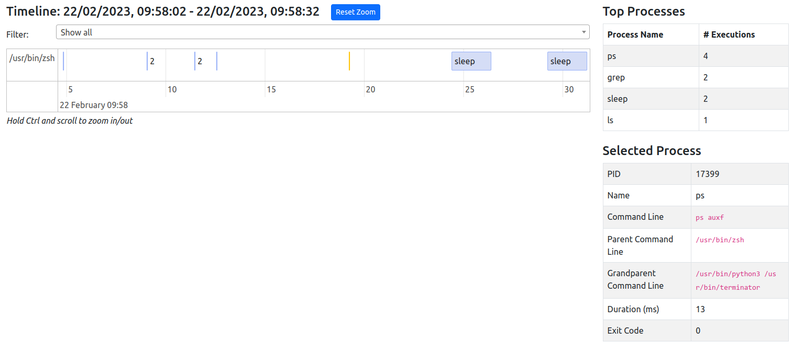

# Linux Process Monitor
Record linux process exec/exit events and produce a timeline of which processes ran.

Designed to help better understand what background processes are running and how long they take to execute.

## Build
```shell
$ mkdir build && cd build
$ cmake -DCMAKE_BUILD_TYPE=Release ../
$ make -j$(nproc)
```

## Run
Start by running ProcessMonitor as root, providing a duration to capture for (in seconds) and a file to save the results into. Note the output file will be a javascript file.
```shell
$ ./ProcessMonitor --duration 60 --output /tmp/processMonitor/results.js
```
Copy the generated output file to `<this-repo-dir>/results_gui/results.js` (must be called results.js for now)

Load the index.html file (Chrome works best) and a timeline of the observed processes should appear.



Note it may take a few minutes for a timeline to load, especially for longer captures with lots of data (your browser may warn you the page is unresponsive, just allow it to continue - be patient!)

The tool will do it's best to work out the "true" command name - i.e. if the command is run under a specific interpreter (`sh -c ls -a`), the tool will work out the true command is actually `ls`.

### Timeline tips
* Hold `Ctrl` and scroll to zoom in/out
* Processes are grouped by their parent process
  * Only show specific parent processes using the filter dropdown
* Click on a process to view more information
* When zoomed out, some processes may be clustered together - shown by a number representing the number of processes in that cluster
  * Zoom in or double-click the cluster to see details!

## Python Analysis Script
For large datasets, the timeline may fail to load or be unwieldly. For this scenario, a python script `results_parser.py` is included.

Usage:
```
$ python3 ./results_parser.py <path-to-results.js>
```

This will analyse the data and produce a report. The report is broken down into 3 sections:

### Processes by Group
This is a list of the number of processes run by a particular script/daemon, including the total number of processes spawned and a breakdown of the processes run.

For example:
```
Processes per group
-----------------------
/usr/sbin/collectd: 55269
	|- awk: 55269 (100.0%)
/lib/rdk/collectd-exec-xi1.sh: 4232
	|- awk: 1244 (29.4%)
	|- pgrep: 1153 (27.24%)
	|- tail: 638 (15.08%)
	|- top: 551 (13.02%)
	|- sleep: 382 (9.03%)
	|- tr: 264 (6.24%)
```

Here we can see:

* The collectd daemon ran 55269 child processes, 100% of which were `awk`
* The `collectd-exec-xi1.sh` script executed 4232 processes, made up of 6 different unique processes. Of the 4232 processes, 1244 (29.4%) of them were awk.

This data can be used to pinpoint daemons/scripts that frequently spawn child processes, and of those child processes which are run most often.

### Top systemd services
This is a list of the systemd services that spawned child processes, sorted by number of child processes seen.

For example:
```
Top systemd services
-----------------------
collectd.service: 59427
logrotate.service: 2843
```

Here, 59,427 child processes were run by the `collectd` systemd service.

### Top Unique Processes
A list of all the processes seen during the ProcessMonitor run, ungrouped, and how many times they were seen.

For example:
```
Top unique processes
-----------------------
awk: 57895
sort: 1303
grep: 1155
```
Here we see whilst ProcessMonitor was running, it saw `awk` run 57895 times in total.